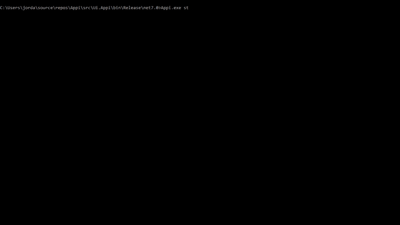

# Appi
What is `Appi`? Appi is short for **App i**nformation.  
  
The goal is to query your sources for information through one tool; all at once, in groups or individually, highly extensible. Accessible from your favorite shell with easy-to-remeber commands from your keyboard without even touching your mouse.  
Because your information sources will be different from mine, go start building your first plugin.

## Features
- Easily provide your [custom plugin](#Plugins)
- Asynchronously fetch all your sources matching your query
- Make use of the given toolset (e.g. for backward navigation)

## Installation
- Install via [NuGet](https://www.nuget.org/packages/Appi): `dotnet tool install --global Appi`
- Build from your own

## Usage
### Demo
This demo shows the `find` command searching for `god` with two active sources (`poetry.db` and `MoreOptions`), selecting and displaying one result (Author, Title, Lines - properties based on `DetailViewColumnAttribute`), and finally taking some action on it (`Quit`).


### Screenshot of multiple results
This screenshot shows the `find` command searching for `e` within all active sources (4). This is for demonstration purposes only, do not try to find any logic in it :)


### Help information
#### `find` command (default, can be omitted)
```
DESCRIPTION:
Query all (default) or only the specified sources.

USAGE:
    Appi find <query> [OPTIONS]

EXAMPLES:
    Appi god
    Appi god -s poetry
    Appi god -g demo
    Appi find god
    Appi find god --source poetry
    Appi find god --group demo

ARGUMENTS:
    <query>                 Search for the given query

OPTIONS:
                            DEFAULT
    -h, --help                         Prints help information
    -g, --group             all        Search within a group
    -s, --source                       Search within a single source
    -c, --case-sensitive               The query parameter will be case-sensitive
```

#### `list` command
List all your installed sources with `Appi list` and see how they can be queried using the `--source` or `--group` option.

```
╔══════════════════╤═════════════════════════════════╤════════╤══════════════════════════════╤══════════════════════════════╗
║ Name             │ Description                     │ Active │ Source alias (-s / --source) │ Group aliases (-g / --group) ║
╟──────────────────┼─────────────────────────────────┼────────┼──────────────────────────────┼──────────────────────────────╢
║ scraped.txt File │ Contents of the file.           │        │ scrapedtxtfile               │                              ║
║ Poetry           │ by poetrydb.org                 │   X    │ poetry                       │ demo                         ║
║ More             │ Non-contextual options          │   X    │ more                         │                              ║
║ Demo Assembly    │ Returns hard-coded hello world. │   X    │ external                     │ demo                         ║
╚══════════════════╧═════════════════════════════════╧════════╧══════════════════════════════╧══════════════════════════════╝
```

#### `config` command
Need to install a your newly created plugin or open the configuration file? Here is how:

```
DESCRIPTION:
Configure Appi.

USAGE:
    Appi config [OPTIONS] <COMMAND>

EXAMPLES:
    Appi config open
    Appi config allow-libs true
    Appi config register-lib E:\my-own-appi-plugin.dll

OPTIONS:
    -h, --help    Prints help information

COMMANDS:
    open                                Opens the app's configuration directory
    allow-libs <allowed: true|false>    Allow or disallow external libraries to be loaded
    register-lib <path>                 Register a new library which is copied to application directory and registred in sources.json
```
See an example of the configuration file [here](https://github.com/jordi1988/Appi/tree/master/examples/sources.json).

## Infrastructure
Some infrastructure classes are already provided. Fetching data from your database is as easy as writing the SQL query for it. You can build up from given classes like:
- **File** (see `sources.json` after running `appi config open` and change the path of your text file)
- **[SQL Server (MSSQL)](https://github.com/jordi1988/Appi/tree/master/examples/MsSqlDemo)**
- **[MySQL / MariaDB](https://github.com/jordi1988/Appi/tree/master/examples/MySqlDemo)**
- **More to come** out of the box (want to collaborate?)

## Plugins
This app is highly extensible by adding own plugins. You can fetch data from any source you can imagine, e. g. from your SharePoint Server, Active Directory or any database.

Just follow these simple steps:
1. Create a .NET 7 class library
2. Add the `Appi.Core` NuGet package as a dependency
    - `PM> Install-Package Appi.Core` for plugin development from scratch or
    - `PM> Install-Package Appi.Infrastructure` for plugin development with pre-built infrastructure like File access, MySQL/MariaDB or Microsoft SQL Server
3. Create classes that implement `ISource` and `ResultItemBase` ([see GitHub examples](https://github.com/jordi1988/Appi/tree/master/examples/ExternalDemoSource))
4. Register the new assembly by calling `appi config register-lib "pathToAssembly.dll"`
5. If applicable: change connection string(s) in sources.json (`appi config open`)
 
### Example for implementing `ISource`
The class implementing `ISource` must either have a parameterless constructor or one that expects `IHandlerHelper`.  
The `ReadAsync()` method must pass the `FindItemsOptions` object which contains the query and returns the found data.  
The initial values of the properties are used to create the entry in the `sources.json` config file when installing your plugin.

``` csharp
using Core.Abstractions;
using Core.Models;

namespace Infrastructure.ExternalSourceDemo
{
    // TODO: should be named SimplePluginDemo
    public class ExternalDemoSource : ISource
    {
        private readonly IHandlerHelper _handlerHelper;

        public string TypeName { get; set; } = typeof(ExternalDemoSource).Name;
        public string Name { get; set; } = "Demo Assembly";
        public string Alias { get; set; } = "external";
        public string Description { get; set; } = "Returns hard-coded hello world.";
        public bool IsActive { get; set; } = true;
        public int SortOrder { get; set; } = 50;
        public string? Path { get; set; }
        public string? Arguments { get; set; }
        public bool? IsQueryCommand { get; set; } = true;
        public string[]? Groups { get; set; } = new[] { "demo" };

        // Either this constructor ...
        public ExternalDemoSource()
        {
        }

        // ... or this constructor
        public ExternalDemoSource(IHandlerHelper handlerHelper)
        {
            _handlerHelper = handlerHelper;
        }

        public async Task<IEnumerable<ResultItemBase>> ReadAsync(FindItemsOptions options)
        {
            var output = new List<ExternalDemoResult>()
            {
                new ExternalDemoResult(_handlerHelper) { 
                    Name = "Hello", 
                    Description = options?.Query ?? "World" 
                }
            };

            return await Task.FromResult(output);
        }
    }
}
```

The example above will create the following entry in `sources.json` file using the command `Appi config register-lib "C:\...\Appi.Infrastructure.ExternalDemoSource.dll"`:
``` json
[
  {
    "TypeName": "ExternalDemoSource",
    "Name": "Demo Assembly",
    "Alias": "external",
    "Groups": [
      "demo"
    ],
    "Description": "Returns hard-coded hello world.",
    "IsActive": true,
    "SortOrder": 50,
    "Path": null,
    "Arguments": null,
    "IsQueryCommand": true
  }
]
```
Your source can now be queried using the `find` command, e. g. `Appi god -s external` or along with other sources inside the `demo` group with `Appi god -g demo`
Of course, the file can be edited to your needs afterwards, e. g. to change the alias or group name.
 
### Example for implementing ResultItemBase
This class controls the output of an item by overriding the `ToString()` method and displays the possible actions with the result of `GetActions()` method if an item of this source gets selected. You can easily interact with **predefined services** like using the `ClipboardService` or `ProcessService` for most frequent used actions.  
By using the `DetailViewColumn` attribute (former `ResultAttribute`) you can define the displayed properties in the output table. Make use of `IHandlerHelper` if you'd like to `EscapeMarkup()` or use pre-defined actions like `Back()` or `Exit()`.

``` csharp
using Core.Abstractions;
using Core.Attributes;
using Core.Models;

namespace ExternalSourceDemo
{
    public class ExternalDemoResult : ResultItemBase
    {
        private readonly IHandlerHelper _handlerHelper;

        [DetailViewColumn]
        public override string Name => base.Name;

        [DetailViewColumn]
        public override string Description => _handlerHelper.EscapeMarkup(base.Description);

        public ExternalDemoResult(IHandlerHelper handlerHelper)
        {
            _handlerHelper = handlerHelper ?? throw new ArgumentNullException(nameof(handlerHelper));
        }

        public override IEnumerable<ActionItem> GetActions()
        {
            var actions = new List<ActionItem>
            {
                _handlerHelper.Back(),
                _handlerHelper.Exit()
            };

            return actions;
        }

        public override string ToString()
        {
            return $"{Name} {Description}!";
        }
    }
}
```

## Up next
- XML docs
- Unit tests
